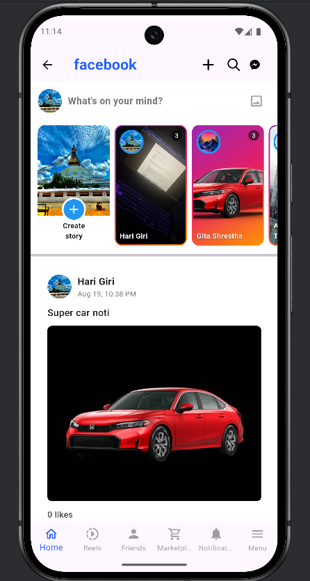
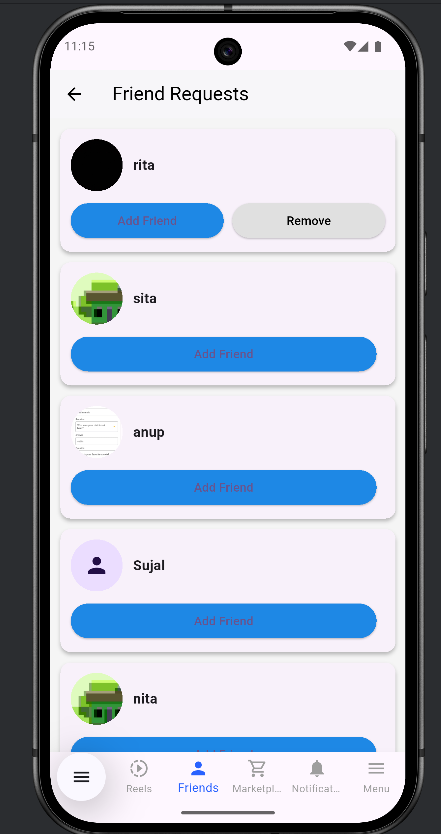
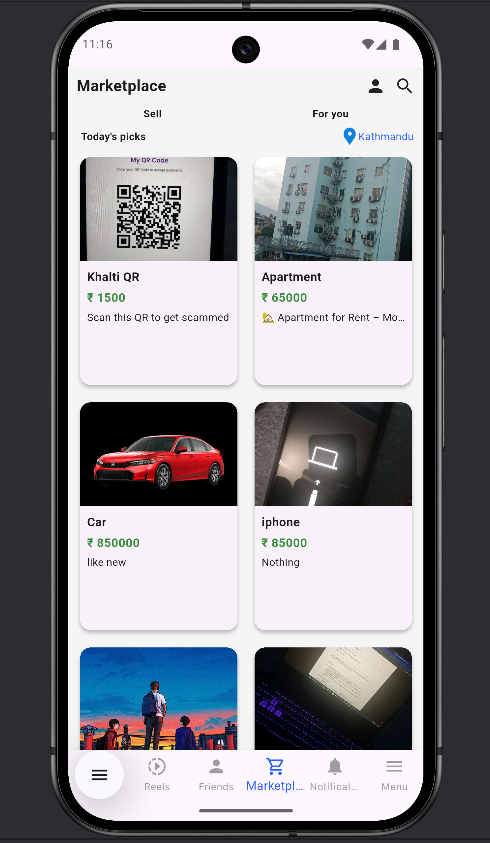
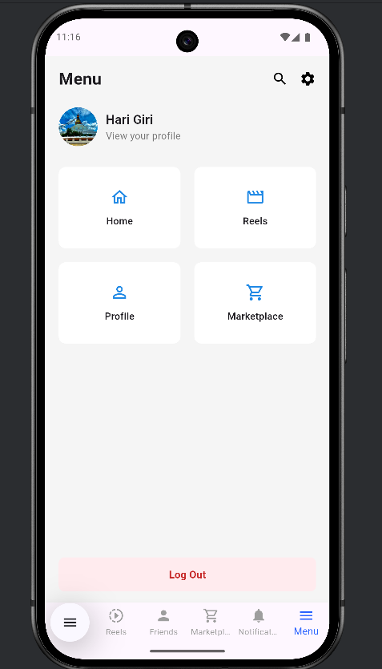
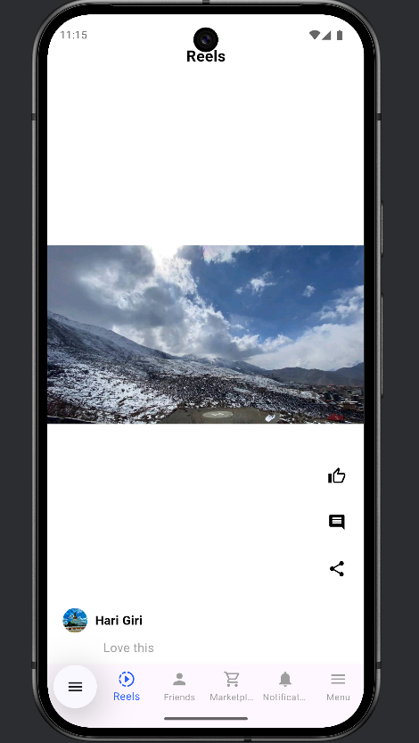

Facebook Clone Flutter App

A fully functional Facebook-style social media app built with Flutter and Firebase, featuring user authentication, posts with images, cover photo edits, profile customization, and more. Inspired by the simplicity and interactivity of Facebook, this app allows users to connect, share, and engage seamlessly.

Features

User Authentication: Sign up, log in, and log out using Firebase Authentication.

Profile Management:

Edit profile picture and cover photo.

Add basic personal info (optional).

Posts:

Upload images with posts.

Social Feed:

Scrollable feed displaying posts from all users.
Like and comment functionalities .

Realtime Updates: All data stored in Firebase Firestore and updated in real-time.

Responsive UI: Works on both Android and iOS devices.

## Screenshots

### Home Screen

### Friends Screen

### Marketplace Screen

### Menu Screen

### Notification Screen

### Reels / Posts Screen

Tech Stack
Flutter – Cross-platform mobile development
Firebase Auth – User authentication
Cloud Firestore – Real-time database
Firebase Storage – Store images and cover photos
Dart – Programming language